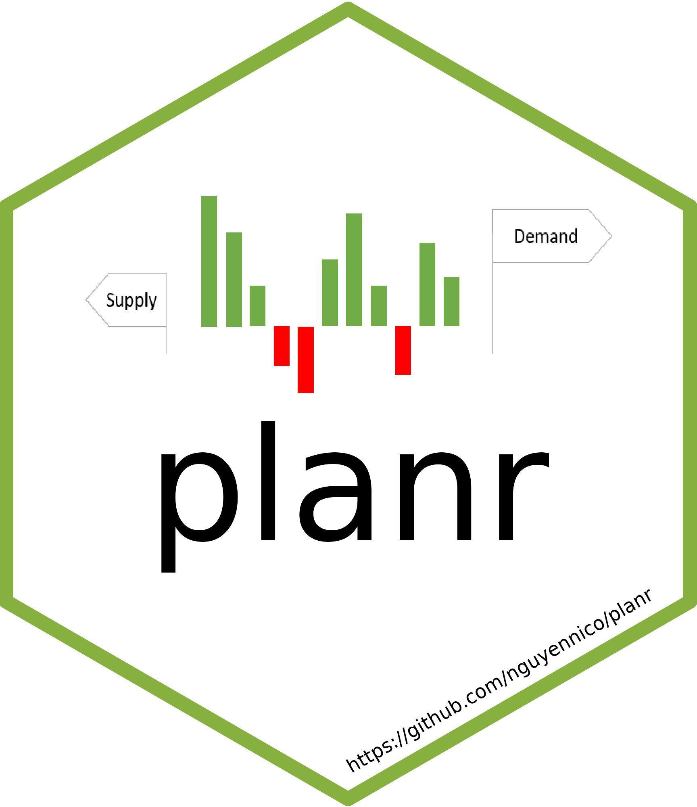
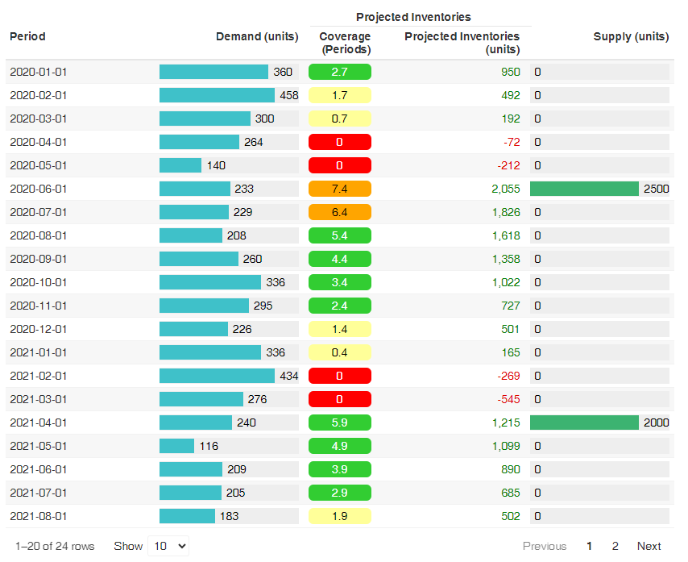
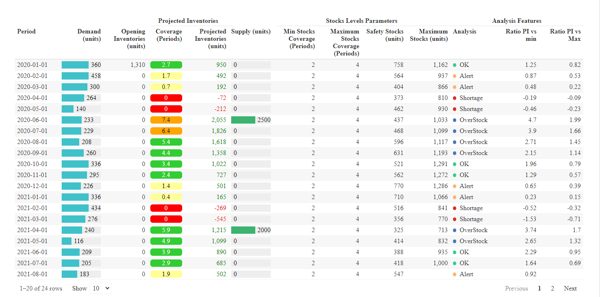
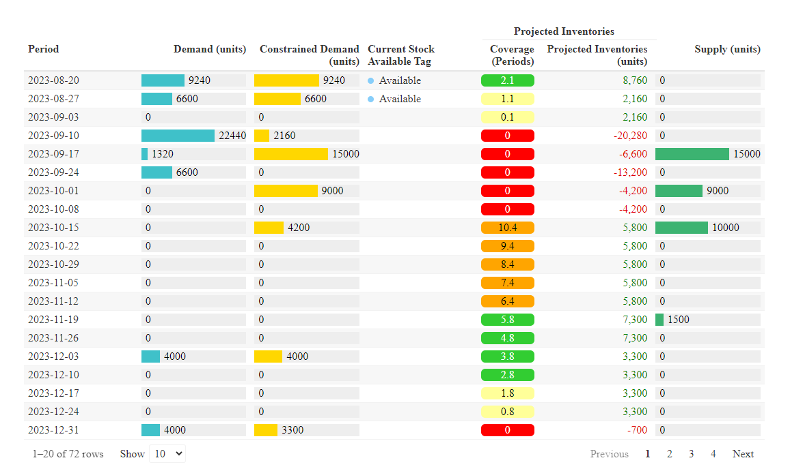
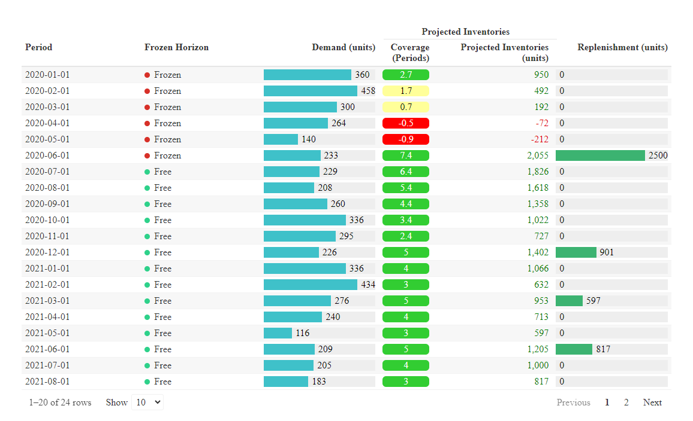
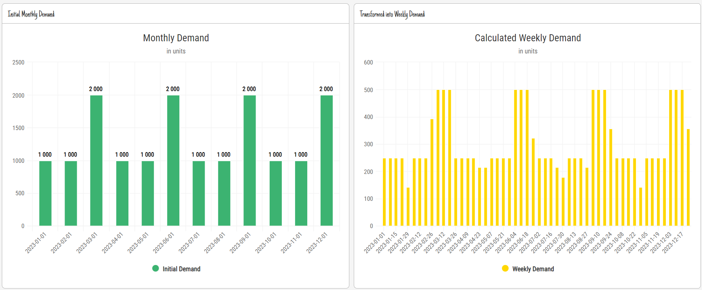
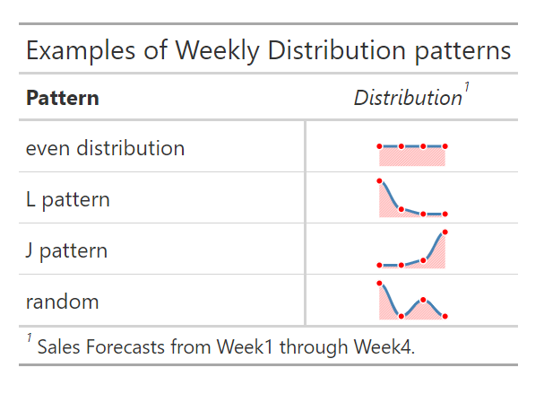
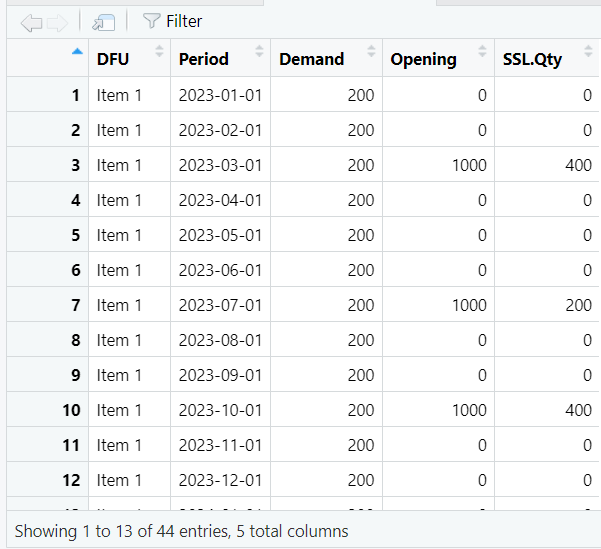
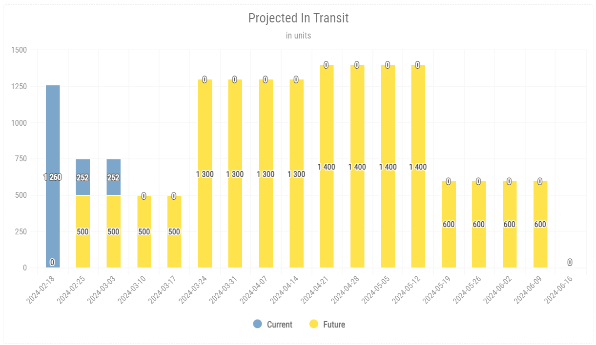

<!-- badges: start -->

[](https://cran.r-project.org/package=planr) [](https://cranlogs.r-pkg.org/badges/grand-total/planr) [](https://cran.r-project.org/package=planr)

<!-- badges: end -->

<!-- README.md is generated from README.Rmd. Please edit that file -->

# planr 

## About

The R package **planr** is for **Supply Chain Management**.\
The goal is to provide some **functions to perform quickly** some classic operations in the scope of **Demand and Supply Planning** or to **run the S&OP** (Sales & Operations Planning) **process**.

There are currently **6 groups** of functions :

-   **Calculation of projected inventories & coverages :**

    -   **simple calculation :** light_proj_inv()

    -   **calculation & analysis :** proj_inv()

-   **Calculation of projected inventories & constrained demand :** const_dmd()

-   **Calculation of Replenishment Plan** (also called DRP) : drp()

-   **Breakdown of Monthly Demand into Weekly Buckets** :

    -   **by default breakdown evenly distributed :** month_to_week()
    -   **custom distribution :** month_to_weekx()

-   **Calculation of Short Shelf Life (SSL) stocks** : ssl()

-   **Projection of In Transit inventories** : proj_git()

Calculations are performed at monthly or weekly buckets.

To learn how to use those functions, refer to the [Cheatsheets](https://niconguyen.quarto.pub/planr/) and the **Get Started** sections of the [website R planr](https://niconguyen.quarto.pub/planr/about.html)

In the parts [Gallery](https://niconguyen.quarto.pub/planr/gallery.html) and [Gallery Shiny](https://niconguyen.quarto.pub/planr/gallery_shiny.html) we can find some examples of visuals and **shiny apps** using this package.

## Installation

To install the CRAN version:

``` r
#install.packages("planr")
library(planr)
```

To install the latest development version from GitHub:

``` r
library(devtools)
#install_github("nguyennico/planr")

library(planr)
```

## Get started

This section introduces the different functions of the package **planr** through :

-   a simple demo on a few items

-   an application on a product portfolio

We will start with **a few functions to calculate projected inventories and coverages.**

### Projected Inventories & Coverages

> The 1st, basic (light) function : **light_proj_inv()**

-   Allows to **calculate quickly the projected inventories and coverages**:

    -   for a SKU
    -   a group of SKUs
    -   at an aggregated level (a Product Family for example)

-   To use it :

    -   [A simple demo](https://rpubs.com/nikonguyen/light_proj_inv_simple_demo)

    -   [Portfolio Calculation](https://rpubs.com/nikonguyen/light_proj_inv_portfolio_demo)



### Calculation & Analysis

> The 2nd function : **proj_inv()**

-   Allows to calculate the projected inventories and coverages

    -   and also to **analyze the projected values based on some parameters (targeted stocks min & Max)**.

-   Useful to filter the data later on and spot which SKU is below the safety stock or in an overstock situation.

    -   We easily can identify when it will be in this situation
    -   and how much, compared to those thresholds

-   To use it :

    -   [A simple demo](https://rpubs.com/nikonguyen/proj_inv_simple_demo)

    -   [Portfolio Calculation](https://rpubs.com/nikonguyen/proj_inv_portfolio_calculation)



> The 3rd function : **const_dmd()**

-   Allows to calculate the projected inventories and coverages, as well as the **Constrained Demand**, which is the **Demand which can be delivered, considering the actual projected inventories**.

-   Useful to provide to a customer (or a receiving entity) the actual Demand which can be fulfilled, and then to calculate the impact on their side.

    -   For example if an Entity 1 supplies and Entity 2 : the Constrained Demand of the Entity 1 becomes the possible Supply Plan to the Entity 2. We then can calculate the expected projected inventories of the Entity 2.

    -   Another usage can be to manage some Allocations : we capture in the initial Demand the full potential of Sales, and based on the projected inventories, we get the Constrained Demand.

-   To use it : here a [demo](https://rpubs.com/nikonguyen/const_dmd_demo)



### Replenishment Plan

A function to calculate a Replenishment Plan (also called DRP : Distribution Requirement Planning).

> The 4th function : **drp()**

-   Based on some parameters (safety stocks, frequency of supply, minimum order quantity) allows to **calculate a Replenishment Plan for an entity**, for example at a Distributor level, and Affiliate, a Regional Distribution Center,...

-   Also **useful in the scope of the S&OP (Sales & Operations Planning) process, to calculate a theoretical, unconstrained, Replenishment Plan**.

-   To use it :

    -   [a simple demo](https://rpubs.com/nikonguyen/drp_demo)

    -   [Portfolio calculation](https://rpubs.com/nikonguyen/drp_portfolio_demo)



### Conversion Monthly to Weekly Bucket

> The 5th function : **month_to_week()**

-   Allows to **convert a Demand initially in Monthly buckets into Weekly buckets**.

    -   By default, it assumes that the Demand is evenly distributed for each week (i.e. 25% of the Demand for each week of the month).

-   We often generate monthly sales forecasts, and want to express this quantity into weekly bucket, to use it later on for the calculation of weekly projected inventories or a DRP for example.

-   To use it : [RPubs - Transformation of Monthly Demand into Weekly Demand](https://rpubs.com/nikonguyen/month_to_week_demo)



> The 5bis function : **month_to_weekx()**

-   Allows to **convert a Demand initially in Monthly buckets into Weekly buckets based on a custom pattern**.
-   Useful to get a more accurate :
    -   projection of inventories & coverages
    -   calculation of Replenishment Plan
-   To use it : [month_to_weekx demo](https://niconguyen.quarto.pub/planr/month_to_weekx.html)



### Short Shelf Life (SSL)

> The 6th function : **ssl()**

Allows to **calculate the projected Short Shelf Life quantities** from based on :

-   the details of Opening Inventories : at which Period of time will some stocks expire or won't have enough Remaining Shelf Life (RSL) for sale and will be blocked

-   the Demand Forecasts

This leads to :

-   a **more precise calculation of the projected inventories and DRP**

-   get a **summary view of the Obsolescence risks**, and **take some actions**

-   To use it : [SSL demo](https://rpubs.com/nikonguyen/ssl_demo)



### Projected In Transit

> The 7th function : **proj_git()**

Allows to **calculate the projected In Transit quantities** to one Entity and a defined product.

It takes into consideration :

-   the **current quantity in transit**

-   the **next (not shipped yet) quantity in transit**

    -   which could be calculated through a DRP for example

-   the **Transit Time**

It can be useful to :

-   monitor the total (local + in transit) projected inventories of one Entity

-   to run some simulations to optimize some DRP parameters & stocks levels

-   To use it : [Projected In Transit demo](https://rpubs.com/nikonguyen/proj_git_demo)



## Links

-   R Views: [Using R in Inventory Management and Demand Forecasting](https://rviews.rstudio.com/2022/10/20/projected-inventory-calculations-using-r-1/)

-   Posit / RStudio Data Science Meetup : [Supply Chain Management](https://www.youtube.com/watch?v=rzs6aSr4XoU)

-   R Shiny app demo for projected inventories : [example of shiny app using the planr package](https://niconguyen.shinyapps.io/Projected_Inventories/)

-   ASCM : [S&OP and the Digital Supply Chain, using R & Python](https://www.ascm.org/ascm-insights/sop-and-the-digital-supply-chain/)

-   Get Started : [Demand and Supply Planning with R](https://rpubs.com/nikonguyen/972907)

-   DRP (Distribution Replenishment Planning) demo shiny app : [Demo DRP app (shinyapps.io)](https://niconguyen.shinyapps.io/DRP_Simulation_app/)

-   2 levels network demo shiny app : [2 Levels Network (shinyapps.io)](https://niconguyen.shinyapps.io/Two_Levels_Network/)

-   Portfolio Calculation of Projected Inventories : [RPubs - Demo Calculation Projected Inventories](https://rpubs.com/nikonguyen/projected_inventories_demo)
