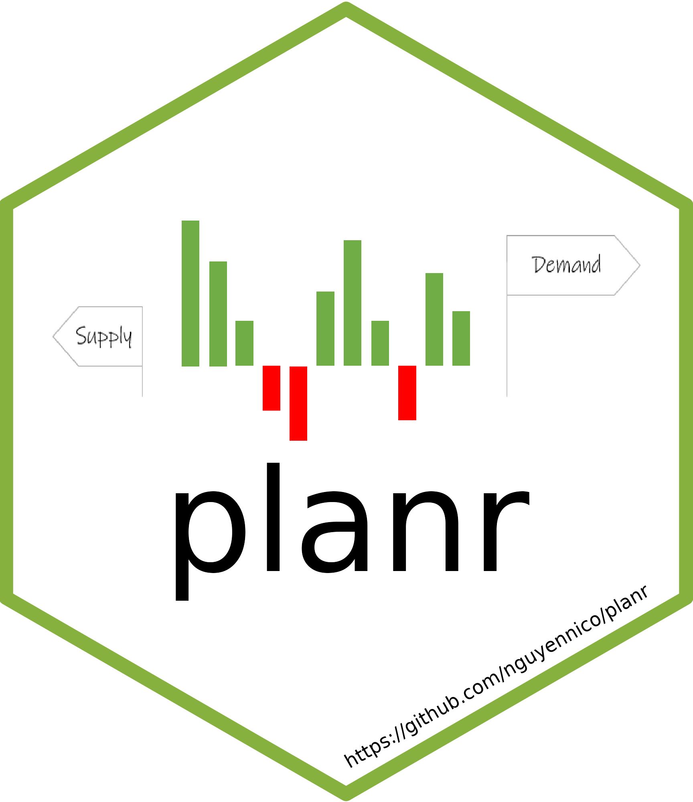

<!-- README.md is generated from README.Rmd. Please edit that file -->

# planr 

The goal of planr is to provide some functions for the activity of
Demand & Supply Planning and S&OP process:

-   to calculate projected inventories and coverages

-   to calculate and analyze projected inventories and coverages

-   to calculate a Replenishment Plan (also called DRP : Distribution
    Requirement Planning)

## Installation

You can install the development version of planr through github:

``` r
library(devtools)
install_github("nguyennico/planr")

library(planr)
```

## Examples

This is a basic example which shows you how to solve a common problem:

Let’s create a demo database:

``` r
Period <- 
  c("1/1/2020", "2/1/2020", "3/1/2020", "4/1/2020", "5/1/2020", "6/1/2020", 
    "7/1/2020", "8/1/2020", "9/1/2020", "10/1/2020", "11/1/2020", "12/1/2020",
    "1/1/2021", "2/1/2021", "3/1/2021", "4/1/2021", "5/1/2021", "6/1/2021", 
    "7/1/2021", "8/1/2021", "9/1/2021", "10/1/2021", "11/1/2021", "12/1/2021")

Demand <- 
  c(360, 458, 300, 264, 140, 233, 229, 208, 260, 336, 295, 226, 336, 434, 276, 
    240, 116, 209, 205, 183, 235, 312, 270, 201)

Opening.Inventories <-
  c(1310, 0, 0, 0, 0, 0, 0, 0, 0, 0, 0, 0, 0, 0, 0, 0, 0, 0, 0, 0, 0, 0, 0, 0)

Supply.Plan <- 
  c(0, 0, 0, 0, 0, 2500, 0, 0, 0, 0, 0, 0, 0, 0, 0, 0, 0, 0, 0, 0, 0, 0, 0, 0)


# assemble
my_demand_and_supply <- data.frame(Period,
                                   Demand,
                                   Opening.Inventories,
                                   Supply.Plan)

# let's add a Product
my_demand_and_supply$DFU <- "Product A"

# format the Period as a date
my_demand_and_supply$Period <- 
  as.Date(as.character(my_demand_and_supply$Period), format = '%m/%d/%Y')

# let's have a look at it
my_demand_and_supply
#>        Period Demand Opening.Inventories Supply.Plan       DFU
#> 1  2020-01-01    360                1310           0 Product A
#> 2  2020-02-01    458                   0           0 Product A
#> 3  2020-03-01    300                   0           0 Product A
#> 4  2020-04-01    264                   0           0 Product A
#> 5  2020-05-01    140                   0           0 Product A
#> 6  2020-06-01    233                   0        2500 Product A
#> 7  2020-07-01    229                   0           0 Product A
#> 8  2020-08-01    208                   0           0 Product A
#> 9  2020-09-01    260                   0           0 Product A
#> 10 2020-10-01    336                   0           0 Product A
#> 11 2020-11-01    295                   0           0 Product A
#> 12 2020-12-01    226                   0           0 Product A
#> 13 2021-01-01    336                   0           0 Product A
#> 14 2021-02-01    434                   0           0 Product A
#> 15 2021-03-01    276                   0           0 Product A
#> 16 2021-04-01    240                   0           0 Product A
#> 17 2021-05-01    116                   0           0 Product A
#> 18 2021-06-01    209                   0           0 Product A
#> 19 2021-07-01    205                   0           0 Product A
#> 20 2021-08-01    183                   0           0 Product A
#> 21 2021-09-01    235                   0           0 Product A
#> 22 2021-10-01    312                   0           0 Product A
#> 23 2021-11-01    270                   0           0 Product A
#> 24 2021-12-01    201                   0           0 Product A
```

It contains some basic features:

-   a Product: it’s an item, a SKU (Storage Keeping Unit), or a SKU at a
    location, also called a DFU (Demand Forecast Unit)

-   a Period of time : for example monthly or weekly buckets

-   a Demand : could be some sales forecasts, expressed in units

-   an Opening Inventory : what we hold as available inventories at the
    beginning of the horizon, expressed in units

-   a Supply Plan : the supplies that we plan to receive, expressed in
    units

### Calculation of Projected Inventories & Coverages

Let’s apply the `light_proj_inv()` function.

We are going to calculate 2 new features for each DFU:

-   projected inventories

-   projected coverages, based on the Demand Forecasts

``` r
# calculate
library(planr)

calculated_projection <-
  light_proj_inv(
    dataset = my_demand_and_supply,
    DFU = DFU,
    Period = Period,
    Demand =  Demand,
    Opening.Inventories = Opening.Inventories,
    Supply.Plan = Supply.Plan
  )
#> Joining, by = c("DFU", "Period")

# see results
calculated_projection
#> # A tibble: 24 × 7
#> # Groups:   DFU [1]
#>    DFU       Period     Demand Opening.Inventories Calculated.…¹ Proje…² Suppl…³
#>    <chr>     <date>      <dbl>               <dbl>         <dbl>   <dbl>   <dbl>
#>  1 Product A 2020-01-01    360                1310           2.7     950       0
#>  2 Product A 2020-02-01    458                   0           1.7     492       0
#>  3 Product A 2020-03-01    300                   0           0.7     192       0
#>  4 Product A 2020-04-01    264                   0           0       -72       0
#>  5 Product A 2020-05-01    140                   0           0      -212       0
#>  6 Product A 2020-06-01    233                   0           7.4    2055    2500
#>  7 Product A 2020-07-01    229                   0           6.4    1826       0
#>  8 Product A 2020-08-01    208                   0           5.4    1618       0
#>  9 Product A 2020-09-01    260                   0           4.4    1358       0
#> 10 Product A 2020-10-01    336                   0           3.4    1022       0
#> # … with 14 more rows, and abbreviated variable names
#> #   ¹​Calculated.Coverage.in.Periods, ²​Projected.Inventories.Qty, ³​Supply.Plan
```
